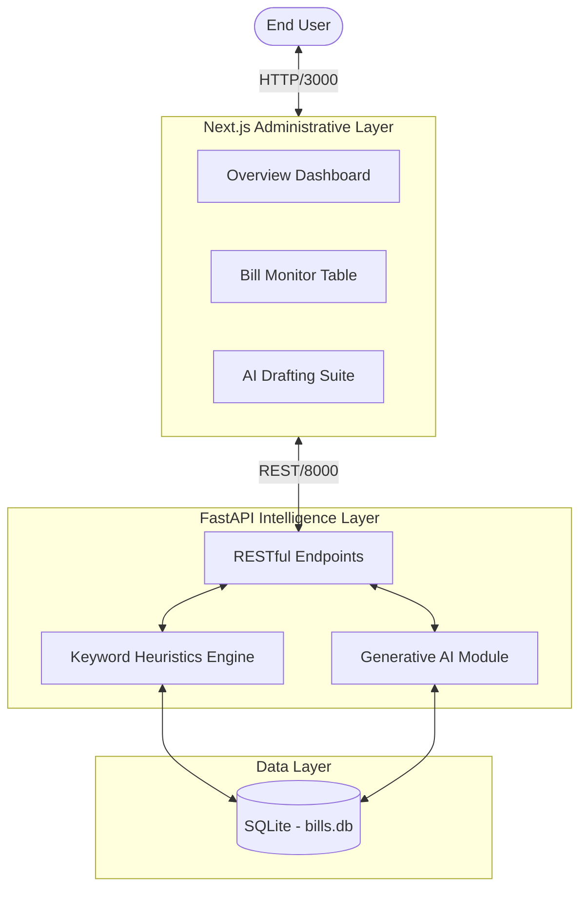

# Policy Alert Engine 📜

> **Intelligent, real-time legislative tracking for ecological advocacy.**

<div align="center">
  
  
  
  
</div>

---

## 📖 Table of Contents
1. [Project Background](#project-background)
2. [System Overview](#system-overview)
3. [Core Features](#core-features)
4. [Architecture & Data Flow](#architecture--data-flow)
5. [Project Structure](#project-structure)
6. [Quickstart Workflow](#quickstart-workflow)
7. [Troubleshooting Guide](#troubleshooting-guide)

---

## Project Background

**The Problem:** Advocacy teams miss critical regulatory windows — comment periods, bill hearings, and agency deadlines — because there's no system monitoring the legislative landscape in real time. By the time someone spots a relevant bill, the window to act has often closed.

**The User:** Policy and government affairs teams at advocacy organizations who need to track and respond to legislative developments across multiple jurisdictions.

**The Solution:** The Policy Alert Engine monitors government databases, legislative feeds, and agency portals for keywords related to animal welfare and ecological impacts. It flags new bills, open comment periods, and hearing dates, and auto-generates draft comment letters or action alerts for the team to review and send.

---

## System Overview

The **Policy Alert Engine** serves as a robust aggregator of legislative bills. By ingesting raw policy data, the platform automatically categorizes documents (e.g., Wildlife, Marine, Climate) and utilizes advanced keyword heuristics mapping to calculate a formalized **Impact Score** (ranging from 0 to 100). 

Bills that cross high-impact thresholds are physically isolated into an urgent alert pipeline, while an integrated AI module utilizes advanced language constraints to generate draft organizational comments regarding specific bills.

---

## Core Features

* 📊 **Bill Monitor Dashboard**: A comprehensive, sortable interface capable of filtering thousands of tracked legislative texts by status, category, date, and impact.
* 🚨 **Automated Policy Alerts**: Specialized rule engines flag high-impact, critical bills and route them directly to stakeholders via the Alerts dashboard.
* 📝 **AI Drafting Assistant**: Incorporates a built-in generative AI drafting module. Capable of generating nuanced public commentary or internal review documents across various tones (Formal, Informal, Urgent).
* 🗄️ **Persistent Edge Storage**: Utilizes a highly portable SQLite configuration optimized for fast read-access via the FastAPI server.
* 🎨 **Dynamic UI/UX**: Features an interface constructed with Next.js App Router, styled cleanly using `shadcn/ui` components and Tailwind CSS for rapid prototyping and responsiveness.

---

## Architecture & Data Flow

The system features a decoupled architecture: a modular Python data processing engine and a reactive Next.js administrative interface.



### 1. Data Ingestion Layer
Raw legislative strings are inserted into the SQLite database (`backend/bills.db`). The backend `/scan` endpoint mimics live ingestion bots.

### 2. Processing Engine (FastAPI)
Upon client request, the Python API (`api/app.py`) parses the database. It simultaneously runs an evaluation script against each text to compute ecological keywords into a standardized **Impact Score**, actively appending real-time priority levels ("Critical", "Watch") directly into the JSON sequence.

### 3. Client Rendering (Next.js)
The frontend (`policy_alert_frontend/`) performs server-side loading logic, caching the generated API payload, transforming the data into interactive Tailwind `<Table>` and `<Badge>` assets.

---

## Project Structure

```text
policy-alert-engine/
├── api/                     # Python Backend Environment
│   ├── app.py               # Primary FastAPI Application routes
│   └── README.md            # Detailed API Documentation
├── backend/                 # Data and Logic Layer
│   ├── ai/                  # AI Generative code modules
│   └── bills.db             # Core SQLite database storage
├── policy_alert_frontend/   # Next.js Application
│   ├── app/                 # Next.js App router core pages
│   ├── components/ui/       # Shadcn UI reusable assets
│   └── README.md            # Detailed Frontend Documentation
├── start_all.sh             # Universal launch script (SEE BELOW)
└── README.md                # This document
```

---

## Quickstart Workflow

We have streamlined the development boot sequence into a single workflow. 

### Prerequisites
* **Python 3.9+**: Required for the FastAPI backend.
* **Node.js v18+ & npm**: Required for the Next.js frontend.
* **Unix-based terminal**: Optimized for macOS or Linux.

### 🚀 Universal Launch
At the root of the project, use the provided bash script to run both the API and the Node server concurrently.

1. **Initialize & Setup:**
```bash
# Install frontend dependencies
cd policy_alert_frontend && npm install && cd ..

# Setup Python environment (if not already done)
python3 -m venv venv
source venv/bin/activate
pip install -r requirements.txt
```

2. **Run the stack:**
```bash
chmod +x start_all.sh
./start_all.sh
```

*The script will automatically:*
1. Activate the Python virtual environment.
2. Boot the **FastAPI Backend** on `http://localhost:8000`.
3. Launch the **Next.js Frontend** on `http://localhost:3000`.
4. Gracefully terminate both processes when you press `Ctrl+C`.

---

## 🛠️ Detailed Working Instructions

### 1. Navigating the Dashboard
Once the system is live at `http://localhost:3000`:
- **Main Dashboard**: View high-level stats (Total Bills, Critical Alerts).
- **Bill Monitor**: The central hub for tracking legislation. Use the search bar to filter by title or use the "Category" dropdown to narrow results.
- **Alerts Feed**: Displays only high-impact items that require immediate attention.

### 2. Understanding Impact Scores
The system calculates an **Impact Score (0-100)** for every bill based on:
- **Category Weights**: Wildlife & Marine bills start with higher base scores.
- **Keyword Heuristics**: Specific terms like "endangered", "conservation", or "pollution" add incremental points.

**Priority Levels:**
- 🔴 **Critical (85+)**: Immediate intervention required.
- 🟠 **High (65+)**: Active monitoring and commentary advised.
- 🟡 **Medium (45+)**: Standard tracking.
- 🔵 **Low (<45)**: Routine archive.

### 3. Using the AI Drafting Assistant
For any bill in the Monitor or Alerts feed, you can generate a draft statement:
1. Click on the bill to open the **Analysis** view.
2. Select a **Tone**:
   - **Formal**: Best for official government submissions.
   - **Informal**: Suitable for social media or community newsletters.
   - **Urgent**: High-pressure drafts for rapidly closing comment windows.
3. The AI (powered by the `/backend/ai` module) will generate a nuanced response based on the bill's content.

---

## ⚙️ Operational Commands

### Data Ingestion (Scanning)
To simulate "scraping" new bills into the system without manual SQL entry, you can trigger the scan bot via the API:
```bash
curl -X POST http://127.0.0.1:8000/scan
```
This adds sample legislative items like the "Marine Fisheries Conservation Bill" to your local `bills.db`.

### Independent Manual Boot
If you need to debug a single layer, you can run them separately:

**Backend Only:**
```bash
cd api
source ../venv/bin/activate
uvicorn app:app --reload
```

**Frontend Only:**
```bash
cd policy_alert_frontend
npm run dev
```

---

## 🔌 API Reference Summary

| Endpoint | Method | Purpose |
| :--- | :--- | :--- |
| `/bills` | `GET` | Returns all bills with computed scores. |
| `/alerts` | `GET` | Returns bills with impact scores $\ge$ 25. |
| `/analyze/{id}` | `GET` | Generates AI draft for a specific bill ID. |
| `/scan` | `POST` | Ingests sample data into the database. |

---

## 🔍 Troubleshooting Guide

**1. "0 Bills Detected" / Badges are White**
Ensure the database path resolves correctly to `/backend/bills.db`. If you run python commands from the root without the API pathing, it may spawn an *empty* database file.

**2. Frontend "Connection Refused"**
The Next.js app expects the API at `localhost:8000`. If you change the API port, you must update the fetch URLs in the frontend source.

**3. ModuleNotFoundError: 'ai'**
The API requires `sys.path` to include the root directory. This is handled automatically in `api/app.py`, but ensure you run the server from the `api/` directory or via `start_all.sh`.
