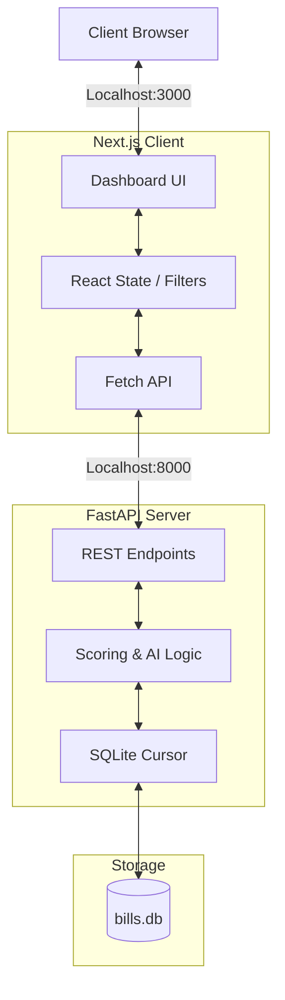

# Policy Alert Engine 📜

An automated, intelligent platform designed for tracking, categorizing, and scoring the ecological impact of environmental and wildlife legislation.

[](https://nextjs.org/)
[](https://fastapi.tiangolo.com/)
[](https://www.sqlite.org/)
[](https://tailwindcss.com/)

---

## 📖 Table of Contents
1. [Project Background](#project-background)
2. [System Overview](#system-overview)
3. [Core Features](#core-features)
4. [Architecture & Data Flow](#architecture--data-flow)
5. [Project Structure](#project-structure)
6. [Quickstart Workflow](#quickstart-workflow)
7. [Troubleshooting Guide](#troubleshooting-guide)

---

## Project Background

**The Problem:** Advocacy teams miss critical regulatory windows — comment periods, bill hearings, and agency deadlines — because there's no system monitoring the legislative landscape in real time. By the time someone spots a relevant bill, the window to act has often closed.

**The User:** Policy and government affairs teams at advocacy organizations who need to track and respond to legislative developments across multiple jurisdictions.

**The Solution:** The Policy Alert Engine monitors government databases, legislative feeds, and agency portals for keywords related to animal welfare and ecological impacts. It flags new bills, open comment periods, and hearing dates, and auto-generates draft comment letters or action alerts for the team to review and send.

---

## System Overview

The **Policy Alert Engine** serves as a robust aggregator of legislative bills. By ingesting raw policy data, the platform automatically categorizes documents (e.g., Wildlife, Marine, Climate) and utilizes advanced keyword heuristics mapping to calculate a formalized **Impact Score** (ranging from 0 to 100). 

Bills that cross high-impact thresholds are physically isolated into an urgent alert pipeline, while an integrated AI module utilizes advanced language constraints to generate draft organizational comments regarding specific bills.

---

## Core Features

* 📊 **Bill Monitor Dashboard**: A comprehensive, sortable interface capable of filtering thousands of tracked legislative texts by status, category, date, and impact.
* 🚨 **Automated Policy Alerts**: Specialized rule engines flag high-impact, critical bills and route them directly to stakeholders via the Alerts dashboard.
* 📝 **AI Drafting Assistant**: Incorporates a built-in generative AI drafting module. Capable of generating nuanced public commentary or internal review documents across various tones (Formal, Informal, Urgent).
* 🗄️ **Persistent Edge Storage**: Utilizes a highly portable SQLite configuration optimized for fast read-access via the FastAPI server.
* 🎨 **Dynamic UI/UX**: Features an interface constructed with Next.js App Router, styled cleanly using `shadcn/ui` components and Tailwind CSS for rapid prototyping and responsiveness.

---

## Architecture & Data Flow

The system operates across a dual-node architecture: a rigorous Python data engine and a reactive React/Next.js interface.



### 1. Data Ingestion Layer
Raw legislative strings are inserted into the SQLite database (`backend/bills.db`). The backend `/scan` endpoint mimics live ingestion bots.

### 2. Processing Engine (FastAPI)
Upon client request, the Python API (`api/app.py`) parses the database. It simultaneously runs an evaluation script against each text to compute ecological keywords into a standardized **Impact Score**, actively appending real-time priority levels ("Critical", "Watch") directly into the JSON sequence.

### 3. Client Rendering (Next.js)
The frontend (`policy_alert_frontend/`) performs server-side loading logic, caching the generated API payload, transforming the data into interactive Tailwind `<Table>` and `<Badge>` assets.

---

## Project Structure

```text
policy-alert-engine/
├── api/                     # Python Backend Environment
│   ├── app.py               # Primary FastAPI Application routes
│   └── README.md            # Detailed API Documentation
├── backend/                 # Data and Logic Layer
│   ├── ai/                  # AI Generative code modules
│   └── bills.db             # Core SQLite database storage
├── policy_alert_frontend/   # Next.js Application
│   ├── app/                 # Next.js App router core pages
│   ├── components/ui/       # Shadcn UI reusable assets
│   └── README.md            # Detailed Frontend Documentation
├── start_all.sh             # Universal launch script (SEE BELOW)
└── README.md                # This document
```

---

## Quickstart Workflow

We have streamlined the development boot sequence into a single workflow. 

### Prerequisites
* Python 3.9+
* Node.js v18+ & npm
* Unix-based terminal (macOS/Linux)

### 🚀 Universal Launch Script
At the root of the project, a bash script runs both the API and the Node server concurrently.

1. **Verify executable permissions:**
```bash
chmod +x start_all.sh
```

2. **Run the stack:**
```bash
./start_all.sh
```

*The script will automatically:*
1. Activate the Python virtual environment (`venv`).
2. Boot the FastAPI background task on `http://localhost:8000`.
3. Change directories natively and launch `npm run dev` on `http://localhost:3000`.
4. Gracefully terminate both processes when you press `Ctrl+C`.

> **Note:** If you prefer to launch the legacy Python-only overview dashboard instead of the React app, you can manually run `streamlit run dashboard.py` from the root directory.

---

## Troubleshooting Guide

**1. FastAPI silently crashes / Python `NameError`**
If the API crashes on boot, verify that your modules load correctly. The `api/app.py` script relies on `sys.path` injection to read the sibling `/backend` folder. Ensure you are executing the server *from inside the `api/` directory* if running manually.

**2. Frontend Shows "Connection Refused"**
The Next.js fetch API is hardcoded to ping `http://localhost:8000`. If it fails, your Python server is likely not running, or it bound itself to `127.0.0.1` while Next.js attempts IPv6 `::1`. Usually, restarting the `start_all.sh` or enforcing the `--host 0.0.0.0` uvicorn flag resolves networking loops.

**3. "0 Bills Detected" / Badges are White**
Ensure the database path resolves to `/backend/bills.db`. If you run python commands from the root, Python may spawn an *empty* `bills.db` file in the wrong directory natively, resulting in missing data.
