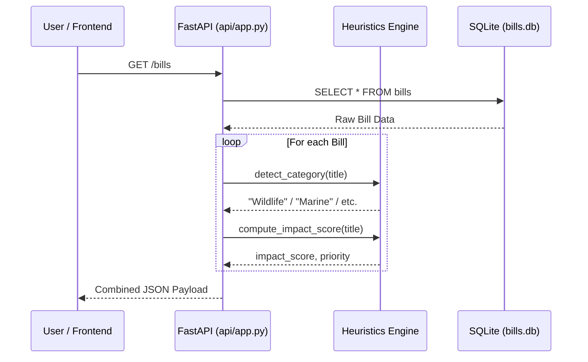
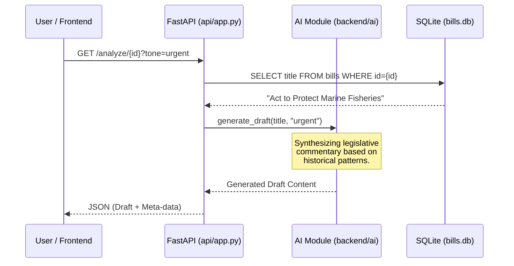
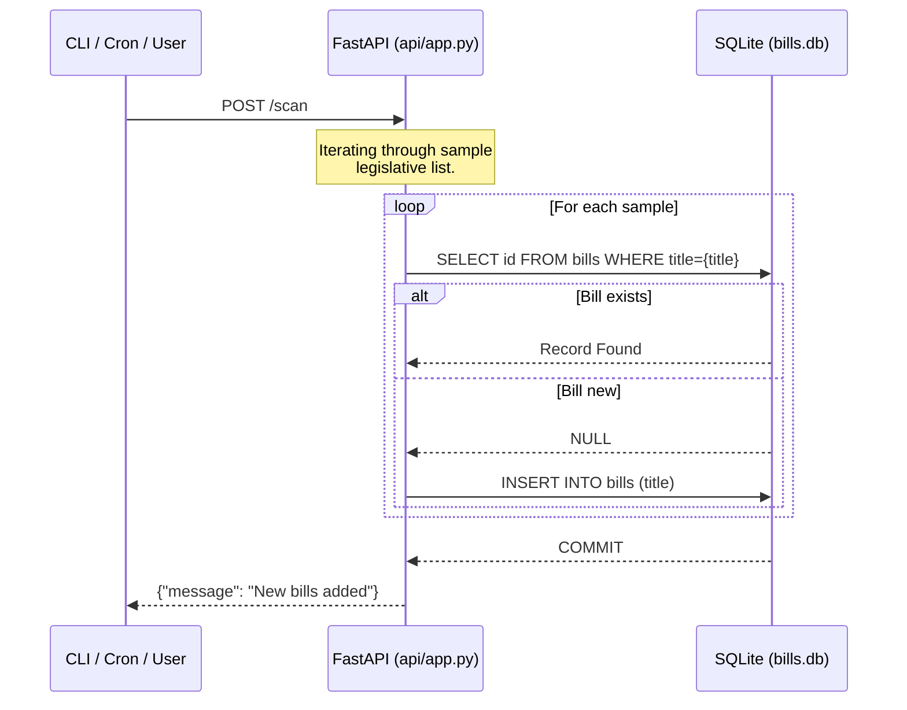

# System Sequence Flow 🔄

This document outlines the detailed sequence of operations for the primary features of the Policy Alert Engine.

## 1. Bill Discovery & Scoring
When a user views the Bill Monitor or when the system "scans" for data.

## 2. AI Drafting Workflow
Triggered when a user requests a legislative statement for a specific bill.

## 3. Data Ingestion (Simulated Scrape)
How new legislation enters the localized environment.

